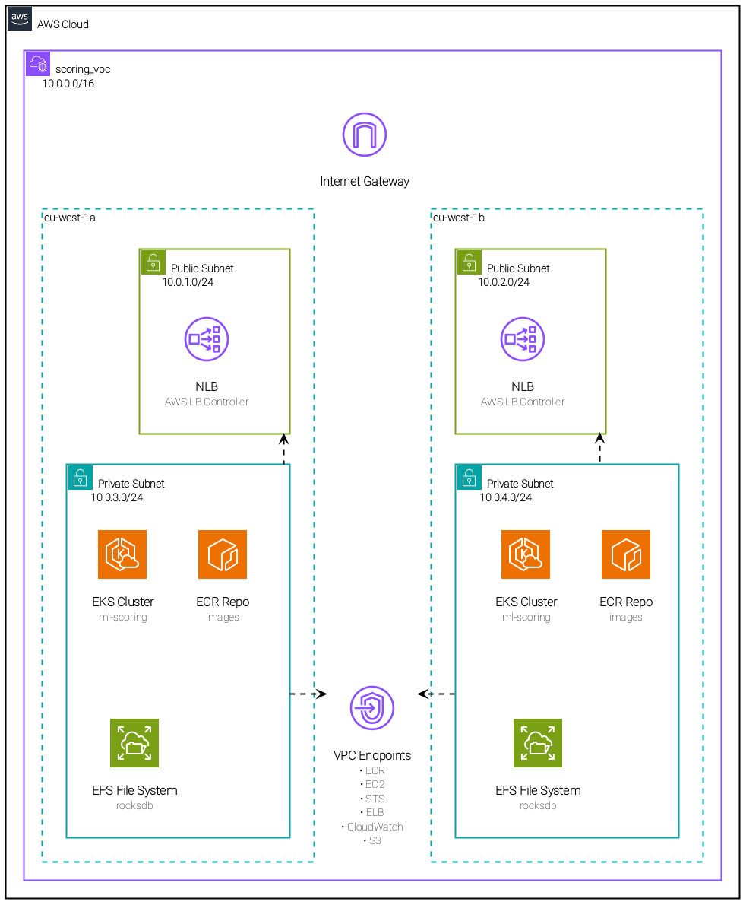

# ML Scoring
Personal PoC of scoring Machine Learning models with Rust. 

The project is structured as follows:

- services: directory with all my rust code 
    - common: simple structs I need in many places, they represent the requests
    - kv-store: rocksdb backed key value store for features
    - scoring_server: actix webserver that scores requests with xgboost
    - update_features: simple script to generate random features and write the 
    rocksdb kv-store.
    - requests-generator: I use this to print random requests for the score endpoint.
    I feed these to vegeta (see justfile). Standard cli tools were too slow.

- k8s: all my k8s files of course 
    - resources: base resources, needed for both loval dev and aws eks
    - overlays: kustomize overlays, diveded in dev for local dev and aws for 
    deploying to aws eks

- terraform: the whole aws infra (this needs a bit of cleaning)
- dockerfiles: the dockerfile needed for the project

## AWS Architecture

The aws architecture is deployed via terraform, here we provide a highlevel diagram:

I tried to avoid the whole nat gateway thing using VPC Endpoints to save some
money as I was paying for this myself.
This was painful honestly, had to push all the helm charts images into my ecr.

## Notes

This is silly/stupid example. I had fun :D.

Open pain points: 

- Prometheus: i get wrong metrics from aws, this is due to alb redirecting requests to different tasks. I should implement a centralized prometheus in aws... but i can't be bothered/out of scope
- Prometheus: should implement some dynimic stuff in for ip. Rn I just get the alb dns out of terraform and manually replace it. Again, was not my goal to begin with
- EFS: I need a better way to create the features in efs, maybe tokio would be faster as rayon is more oriented to cpu bound tasks.

The project is a bit all over the place, but order was not the goal.

On the bright side: the whole thing does respond in less than 30ms (which was the objective)
